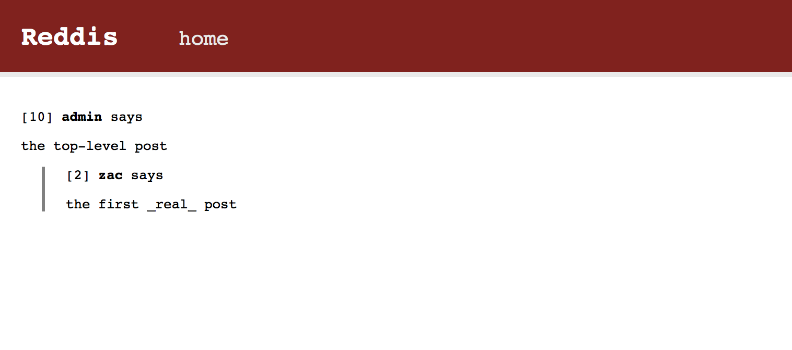

# Reddis

A Reddit clone using redis. Just cloning the repository and running it won't work,
since you need to start a redis server first. To do that, install redis (look it up)
then navigate to your cloned directory and run `$ redis-server`. This will start
a database, but it will be empty. At the very least, you need to add a key called
`posts` which you can initialise to an empty set.

As well as setting up the server, you'll need to create an SSL certificate, since
Reddis wants to run on `https`, not `http`. To generate your certificate, go to
the project directory and run:

```
go run generate_cert.go --host <your host; possibly localhost>
```

Now you can `$ go run main.go` to start up the server. When you connect to it in the
browser, it will probably tell you the site can't be trusted, but will also give
you the option to go to it anyway. Do this once, and it shouldn't ask you again.


